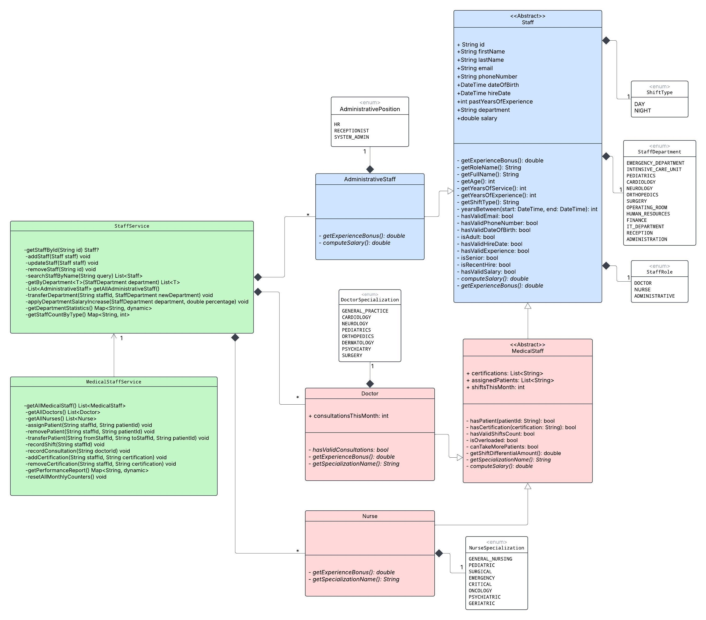

# Hospital Management System

A small hospital management system implemented in Dart. This repository contains domain models, simple file-based repositories, services and a CLI UI used to manage hospital staff (doctors, nurses and administrative staff).

## Use Case

## UML Diagram

